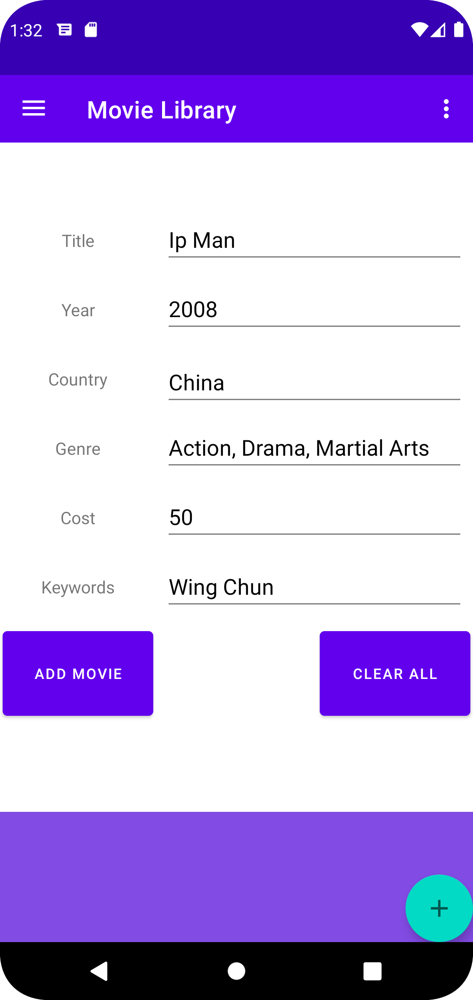
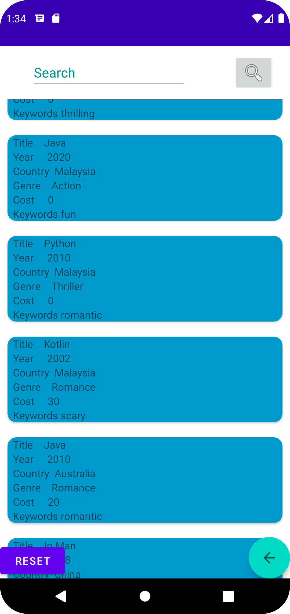
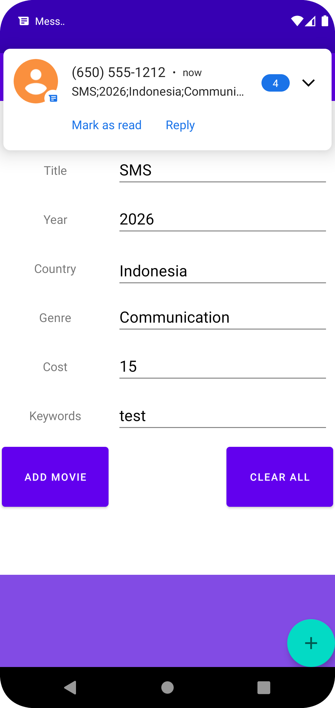

# Native Android Movie Library Application

A robust Android application, featuring hardware-level gesture interaction layers.

## Advanced Computer Science Paradigms Demonstrated

This project showcases mobile software architecture:

* **Asynchronous Intent Parsing (BroadcastReceiver Gateway):** Implements an OS-level background event listener that securely intercepts incoming system payloads. It parses tokenized data formats via a deterministic semicolon delimiter pipeline (`SMS;Year;Indonesia;Genre;Cost;Keywords`), instantly routing and extracting variables into active memory states without blocking the main UI thread.
* **Hardware Touch Layer Interception:** Moves past basic touch listeners to implement advanced hardware event tracking. By overriding native UI touch pipelines, the application captures and processes localized double-tap configurations within designated canvas boundaries to automate form initialization and state resets.
* **Data Layer Abstraction & Search Indexing:** Integrates a centralized repository pattern that abstracts underlying data sources, exposing smooth runtime data structures for real-time querying, sorting, and live filtering across movie cache lists.

## Tech Stack & Methods
* **Language:** Java / Android SDK
* **Architecture:** Repository Pattern, Observer Pattern
* **Components:** BroadcastReceiver, Core Intent Filters, Jetpack UI/Lifecycle Components
* **Testing:** Emulator-driven system intent injection, hardware gesture validation

## Application Interface & Gateway Preview

### 1. Data Capture & Gesture-Driven Initialization
The user interface flows state changes cleanly through android lifecycle. The input form supports automated configurations, such as triggering an instantaneous form reset or template population via a custom double-tap gesture executed inside the application canvas space:

| Double-Tap Gesture Initialization State |  Movie List Querying |
|:---:|:---:|
|  |  |

### 2. Asynchronous Notification Gateway Interception
Demonstrating background system event interception via a specialized `BroadcastReceiver` gateway. The app listens for explicit intent strings, parses incoming semicolon-delimited text payloads, and routes the tokenized properties to instantly populate the application’s input fields:

