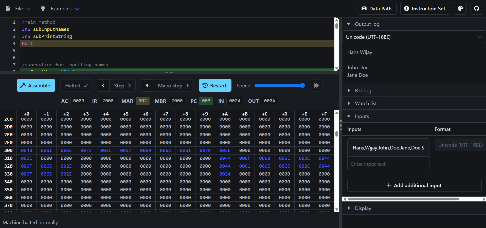
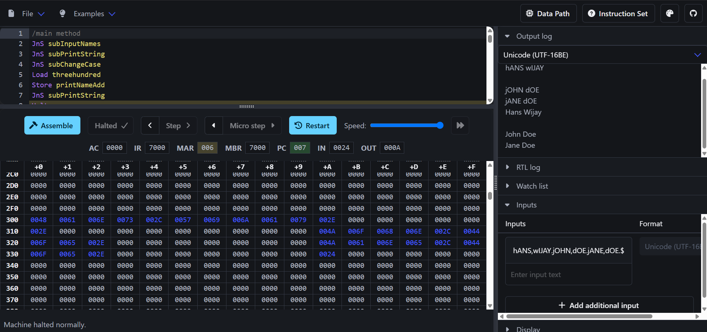
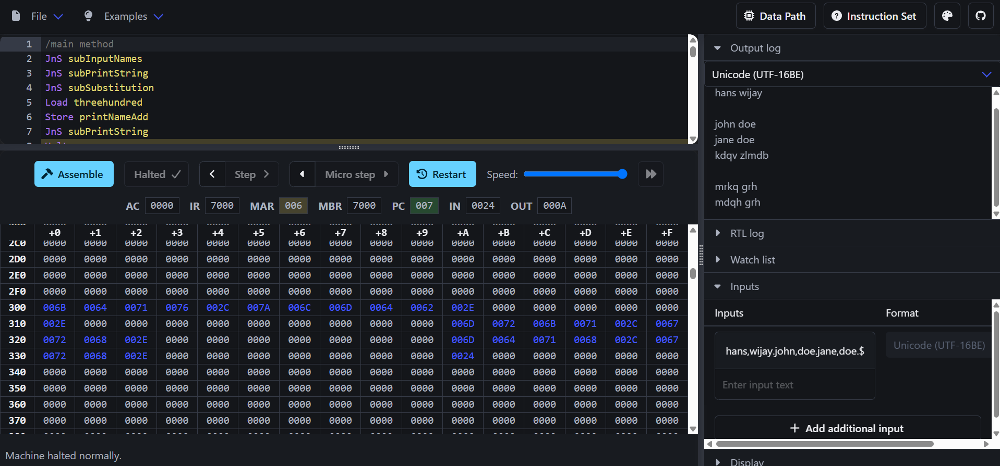

# Low-Level Architecture Logic & Hardware String Processing

A collection of hardware-level assembly utilities written in MARIE assembly instruction sets, demonstrating memory layout configurations, pointer structures, and programmatic control-flow routines.

## Computer Science Paradigms Demonstrated

This codebase moves past abstract, high-level structural languages to interface directly with simulated hardware register architectures and memory buses:

* **Indirect Pointer Referencing:** Extensively uses indirect storage and retrieval primitives (`LoadI` and `StoreI`) to navigate index vectors safely, allowing variables to serve as pointers to look up arrays starting at address boundary `Hex 300`.
* **Bitwise Text Modification and Encoding Loops:** Implements custom character operations via binary arithmetic manipulations. Case conversion utilities programmatically isolate lowercase and uppercase offsets dynamically via absolute mathematical translations:
  $$\text{Char}_{\text{lower}} = \text{Char}_{\text{upper}} + 32_{10}$$
* **Relative Map Substitution Encryption:** Features a manual hardware substitution cipher array mechanism (`mySubstKey1`). By calculating index-relative base address variations (`ADR mySubstKey1` added to a standardized base-character offset), the system executes a modular 3-alphabet Caesar substitution array directly on structural registers.
* **Complex Structural Control Splitting:** Overcomes primitive hardware design bounds by chaining evaluation jumps (`Skipcond 400`, `Skipcond 800`) to create multi-path execution trunks, validating input arrays against control flags (e.g., `,`, `.`, and `$`).

## Tech Stack & Methods
* **Language:** MARIE Assembly Language (Machine Architecture that is Really Intuitive and Easy)
* **Architectural Elements:** Direct/Indirect Memory Addressing, Vector Baselines, Register Subroutines (`JnS`, `JumpI`), Custom Lookup Maps
* **Testing:** Executed and validated within the graphical MARIE Sim environment framework

## Output Preview
Here are the full system execution profiles captured directly inside the MARIE Sim graphical framework, verifying active register modifications, memory cell population at address `300H`, and terminal outputs:

  
  
  

## System Limitations & Constraints
Due to the constraints of a primitive 12-bit/16-bit hardware architecture and fixed memory offset mappings, the software enforces the following runtime parameters:

Strict 10-Character Record Limits: Individual text component names are capped at a maximum of 10 characters. Exceeding this token buffer threshold results in memory leaking across index rows, corrupting consecutive database entries.

Deterministic Parsing Delimiters: Data streaming expects a fixed structure containing exactly 3 complete names, segmented by explicit sentinel characters:

First name and last name must be split by a comma (,).

Each complete full name record must terminate with a full stop (.).

The entire batch run must be halted using a trailing dollar sign sentinel ($).

Cipher Casing Restriction: The substitution lookup loop inside 2_3_AlphabetSubstitution.mas calculates its array offset using a base-reference translation anchored to lowercase characters. Consequently, the encryption engine exclusively supports lowercase alphabet matrices; passing uppercase blocks shifts execution registers out of the lookup array's valid bounds.