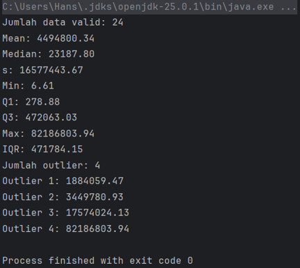

# Enterprise Excel Data Parser & Statistical Compiler

A standalone Java utility that programmatically streams, processes, and extracts raw transactional market datasets from complex spreadsheet architectures without relying on heavy external mathematical engines.

## Computer Science Paradigms Demonstrated

This project showcases clean software engineering design alongside custom data pipeline optimization structures:

* **Efficient Byte-Stream Processing:** Utilizes the Apache POI event model layer (`XSSFWorkbook`) to securely open file streams (`FileInputStream`), isolating structural spreadsheet rows dynamically while ignoring invalid, empty (`null`), or corrupted blank cells.
* **Dynamic Header Index Mapping:** Instead of relying on rigid, hardcoded column maps, the engine utilizes a deterministic scanning phase on initialization to pinpoint the exact variable column index matching target keywords (e.g., `Dollars`), gracefully adapting to changing upstream data layouts.
* **Manual Linear Interpolation Fractions:** Rather than using discrete indexing shortcuts, the custom `quartil` engine accurately addresses both integer configurations and partial midpoints by manually calculating decimal residue weights ($index - \lfloor index \rfloor$) across floor and ceiling boundaries:
  $$\text{Value} = \text{List}[\lfloor i \rfloor] + \delta \times (\text{List}[\lceil i \rceil] - \text{List}[\lfloor i \rfloor])$$
* **Outlier Boundary Pipeline:** Implements structural verification logic using custom Interquartile Range ($IQR$) bounds. The pipeline finds statistical anomalies on a $1.5 \times IQR$ threshold scale while maintaining structural limits to prevent runtime out-of-bounds heap overflows.

## Tech Stack & Methods
* **Language:** Java (JDK 8+)
* **Libraries:** Apache POI API (`poi-ooxml`)
* **Paradigms:** Object-Oriented Programming (OOP), Data Streaming Pipelines, Linear Interpolation Algorithms
* **Testing:** Functional validation against industrial financial market datasets

## Compilation & Output Preview

When executed, the class processes the specified market spreadsheet, prints structural telemetry to the terminal console, and immediately exposes system outliers inside the data distribution:

