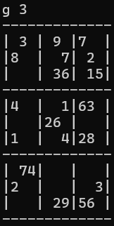
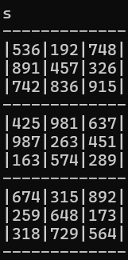

# Constraint-Satisfaction Sudoku Engine (Solver & Generator)

A standalone Python implementation of a multi-dimensional matrix Sudoku solver and deterministic board generator. 

## Advanced Computer Science Paradigms Demonstrated

This project moves beyond naive brute-force backtracking by integrating constraint satisfaction heuristics to substantially prune execution depth:

* **Heuristic Optimization (MRV):** Implements the **Minimum Remaining Values** heuristic (`minimumoptions`). The solver dynamically scans the matrix and prioritizes filling cells with the absolute lowest number of valid candidates, minimizing invalid tree branches.
* **Deterministic Constraint Propagation:** Features a deductive inference pipeline (`value_by_single`). It loops continuously to identify and resolve both forward and backward "singles" across rows, columns, and subgrids, solving large portions of the board mathematically before relying on recursion.
* **Algorithmic Self-Auditing:** The unique board generator ensures that when digits are programmatically omitted from a completed board, the remaining puzzle mathematically preserves exactly one unique solution.
* **Dynamic Grid Scaling:** Architected with dynamic root tracking allowing the engine to adapt naturally to $4\times4$ ($2\times2$ subgrids), standard $9\times9$ ($3\times3$ subgrids), and heavy $16\times16$ ($4\times4$ subgrids) layouts.

## Tech Stack & Methods
* **Language:** Python 3
* **Paradigms:** Backtracking, Constraint Satisfaction, Structural Backtracking, Matrix Manipulation, Automated Heuristic Selection
* **Testing:** Manual testing

## Interface Preview
### 1. Deterministic Board Generation
Using the `generate` command pipeline (e.g., executing `g 3`), the engine dynamically evaluates solution uniqueness and builds a standard $9\times9$ grid with balanced cell hints:

### 2. Constraint-Based Solution
Using the `solve` command pipeline (executing `s`), the engine uses backtracking solve algorithm or deductive inference algorithm and updates the matrix and prints the completed solution, which can be seen here:

